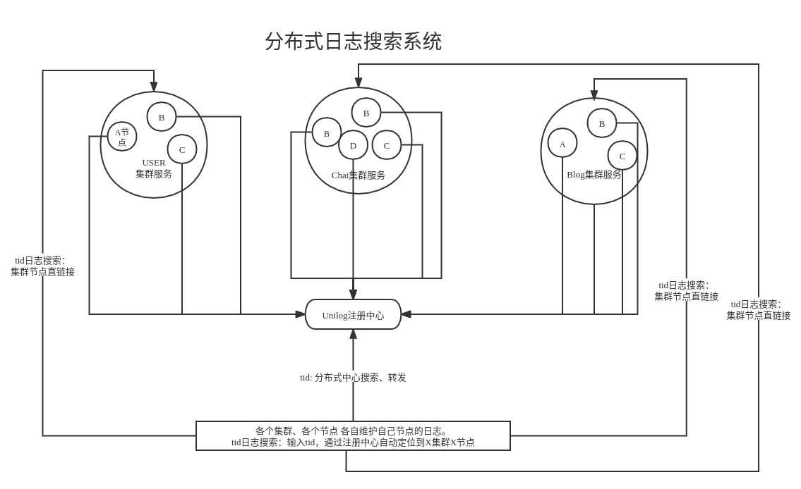
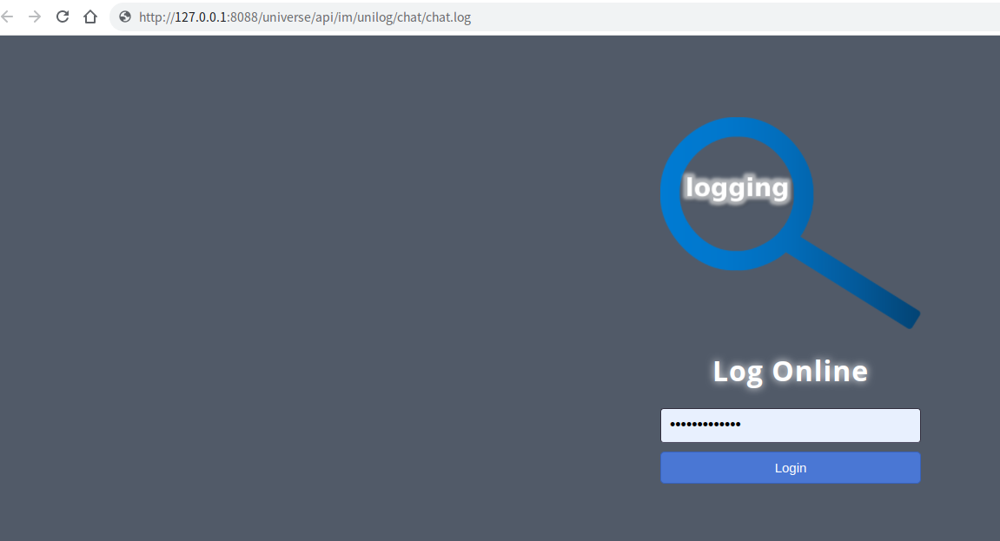
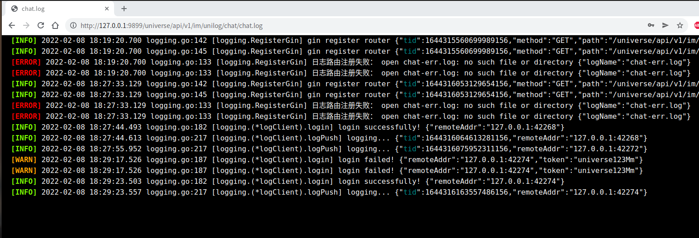
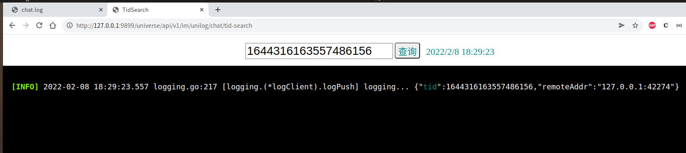

# logging

- ELK日志搜索终结者
- 无需数据库，支持超大（GB级别）**全链路日志**毫秒级别搜索。
- 更新log在线查看技术架构,由ajax短轮询升级为SSE推送.
- 统一日志管理界面
- 支持反向代理日志节点
- 日志全链路搜索支持分布式、支持单机。
- 2022/05/14: 重磅更新：路由地址添加接口化
    - 新增支持标准库http包（http.ServerMux）、支持gin框架、（可以灵活添加支持各种go的web框架，实现Router接口即可.）
    - 注：使用gin不再对反向代理模式查看日志支持（支持http.ServerMux），未来考虑淘汰此种方式，请使用log-navi导航查看实时滚动日志

### 项目结构示意图



### API

- Init:   通用的初始化方式, http服务启动前进行调用。
- RegisterGin： 低层级的初始化方式，一般推荐使用Init。

### Usage

- main.go

```go

package main

import (
	"flag"
	"fmt"
	"io"
	"os"

	"github.com/gin-gonic/gin"
	"github.com/vito-go/logging"
	"github.com/vito-go/logging/tid"
	"github.com/vito-go/mylog"
)

func main() {
	port := flag.Int("p", 9899, "specrify port ")
	flag.Parse()
	engine := gin.Default()
	appName := "chat"
	logInfoPath := "chat.log"
	logErrPath := "chat-err.log"
	fInfo, err := os.OpenFile(logInfoPath, os.O_CREATE|os.O_RDWR|os.O_APPEND, 0644)
	if err != nil {
		panic(err)
	}
	fErr, err := os.OpenFile(logInfoPath, os.O_CREATE|os.O_RDWR|os.O_APPEND, 0644)
	if err != nil {
		panic(err)
	}
	mylog.Init(fInfo, io.MultiWriter(fInfo, fErr), io.MultiWriter(fInfo, fErr), "tid")
	unilogServerAddr := ""                        // 单机版本，分布式注册中心地址可为空
	basePath := "/universe/api/im/unilog/logging" // 单机版本，分布式注册中心地址可为空
	logging.Init(engine, *port, logging.BasePath(basePath), unilogServerAddr, logging.Config{
		APPName:     appName,
		Token:       "abc123",
		LogInfoPath: logInfoPath,
		LogErrPath:  logErrPath,
	})
	engine.GET("/hello", func(ctx *gin.Context) {
		ctx.Set("tid", tid.Get())
		mylog.Ctx(ctx).WithField("path", ctx.Request.URL.Path).Info("request==>")
		ctx.JSON(200, "hello")
	})
	engine.Run(fmt.Sprintf(":%d", *port))
}

```

```shell
go run ./main.go
```

> http://127.0.0.1:9899/universe/api/v1/im/unilog/chat/chat.log

- input the login token: abc123



- we can see the log stream
  

#### 通过tid对日志全链路进行搜索

> http://127.0.0.1:9899/universe/api/v1/im/unilog/chat/tid-search



### TODO

- 自动滚屏日志目前采用SSE技术方案推送服务日志，计划支持websocket
- 目前仅支持gin框架，计划支持所有的web框架
- 目前不支持切割后的日志文件的搜索（暂且不建议切割，或者有需要的话日志达到特别大如1GB后再进行考虑切割）